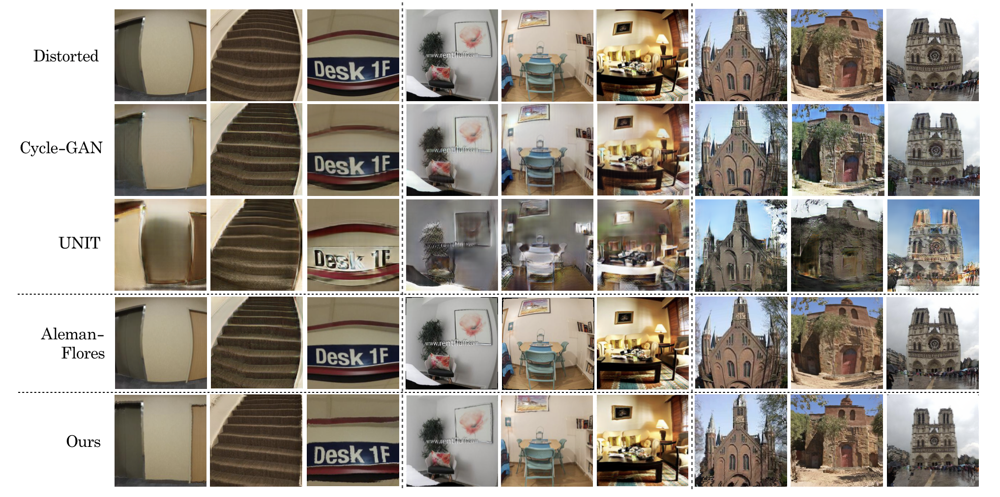

# Self-Supervised Deep Learning for Fisheye Image Rectification



This is the official pytorch implementation of [Self-Supervised Deep Learning for Fisheye Image Rectification](). It is revised from [pytorch-CycleGAN-and-pix2pix](https://github.com/junyanz/pytorch-CycleGAN-and-pix2pix) and [GCGAN](https://github.com/hufu6371/GcGAN). The code is written by [Byron Hsu]() and [Brian Chao]() from Department of Electrical Engineering, National Taiwan University. This work is currently in the submission to [2020 ICASSP](https://2020.ieeeicassp.org/). 

We welcome any advice for this work. Feel free to send issue or PR!

## Installation
1. Clone the project
```
git clone ...
```
2. Install the prerequisites
```
pip3 install -r requirements.txt
```

## Training
1. Start training!
```
bash train_gcgan.sh [dataset_path] [name]
```
2. Monitor the training process by tensorboard
```
tensorboard --logdir runs
```
## Testing
```
bash test_gcgan.sh [dataset_path] [name] [which_epoch]
```